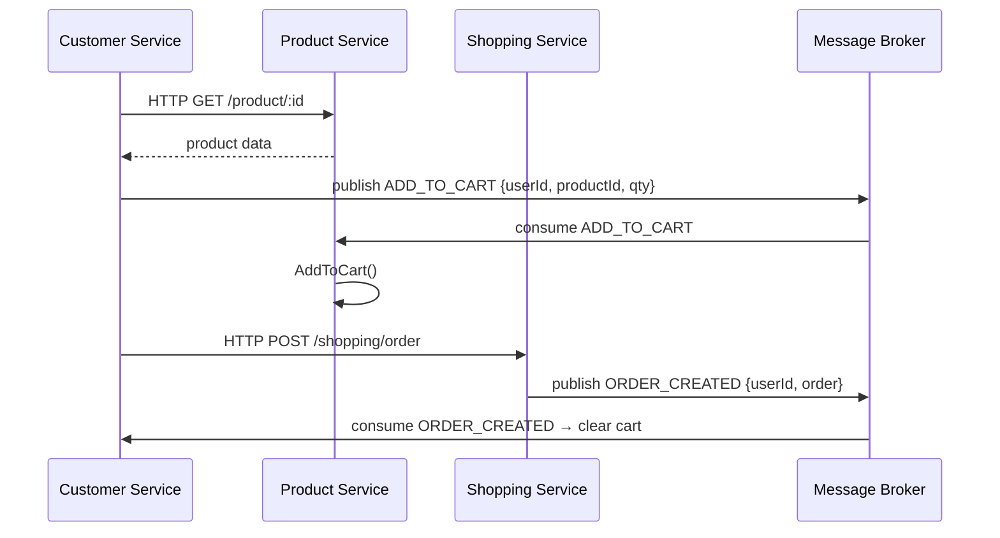

# 🛒 Shopping App — Monolith → Microservice Geçiş Rehberi

Bu proje **monolithic** mimaride çalışır. Ancak kod, microservice'e geçiş sırasında **minimum değişiklik** gerektirecek şekilde organize edilmiştir.

---

## 📁 Mevcut Yapı (Monolith)

```
backend/src/
├── api/                  ← HTTP route handler'ları (sadece kendi servisi import eder)
│   ├── customer.js       → CustomerService
│   ├── products.js       → ProductService
│   ├── shopping.js       → ShoppingService
│   └── middlewares/
│       └── auth.js       → JWT doğrulama
├── services/             ← Business logic (tek sorumluluk)
│   ├── customer-service.js
│   ├── product-service.js
│   └── shopping-service.js
├── database/
│   ├── models/           ← Mongoose schema'ları
│   ├── repository/       ← DB CRUD işlemleri
│   └── connection.js
├── config/               ← Env değişkenleri
└── utils/                ← JWT, bcrypt, hata sınıfları
```

### Mimari Kurallar (Şu An Geçerli)

| Kural | Açıklama |
|-------|----------|
| **Route → Tek Servis** | Her route dosyası yalnızca kendi servisini import eder |
| **Cross-domain iş → Servis Katmanı** | Örn: Ürün eklenince sepete de eklenmesi `ProductService` içinde yapılır |
| **SubscribeEvents stub** | Her serviste event bus için hazır bir metot var |

---

## 🚀 Microservice'e Geçiş Adımları

### 1. Klasör Yapısını Kopyala

Her domain için yeni bir repo oluştur:

```
customer-service/
product-service/
shopping-service/
```

Her servise kopyalanacak dosyalar:

| Domain | Kopyalanacak Dosyalar |
|--------|----------------------|
| **customer-service** | `api/customer.js`, `services/customer-service.js`, `database/models/Customer.js`, `database/models/Address.js`, `database/repository/customer-repository.js` |
| **product-service** | `api/products.js`, `services/product-service.js`, `database/models/Product.js`, `database/repository/product-repository.js` |
| **shopping-service** | `api/shopping.js`, `services/shopping-service.js`, `database/models/Order.js`, `database/repository/shopping-repository.js` |
| **Tüm servisler** | `config/index.js`, `utils/`, `api/middlewares/auth.js`, `database/connection.js` |

> [!IMPORTANT]
> Her servis **kendi bağımsız MongoDB veritabanına** bağlanır. Ortak collection kullanmayın.

---

### 2. Cross-Domain Veri Erişimini Değiştir

Monolith'te bazı servisler başka domain'in repository'sine erişir. Microservice'te bunlar **HTTP call** veya **message broker event**'ine dönüşür.

#### 📌 Değiştirilmesi Gereken Noktalar

```
# product-service.js içindeki bu satır kaldırılacak:
this.customerRepository = new CustomerRepository();

# Yerine gelen: HTTP client (axios)
const response = await axios.post(`${CUSTOMER_SERVICE_URL}/customer/cart`, { ... });
```

| Servis | Metot | Şu An | Microservice'te |
|--------|-------|-------|----------------|
| `ProductService` | `AddToWishlist` | CustomerRepository çağırır | CustomerService'e HTTP POST |
| `ProductService` | `AddToCart` | CustomerRepository çağırır | CustomerService'e HTTP POST |
| `ShoppingService` | `GetCart` | CustomerRepository çağırır | CustomerService'e HTTP GET |
| `ShoppingService` | `PlaceOrder` | ShoppingRepository + CustomerRepository | Event yayınla: `ORDER_CREATED` |

---

### 3. SubscribeEvents → Gerçek Message Broker'a Bağla

Her serviste `SubscribeEvents(payload)` metodu hazır. Bunu RabbitMQ/Kafka consumer'ına bağla:

```js
// Örnek: RabbitMQ consumer (her servis için)
const amqp = require("amqplib");

const connectToMessageBroker = async (service) => {
  const connection = await amqp.connect(MSG_QUEUE_URL);
  const channel = await connection.createChannel();

  await channel.assertQueue("PRODUCT_SERVICE");

  channel.consume("PRODUCT_SERVICE", (msg) => {
    const payload = JSON.parse(msg.content.toString());
    service.SubscribeEvents(payload);
    channel.ack(msg);
  });
};

// index.js'de:
const productService = new ProductService();
await connectToMessageBroker(productService);
```

#### Event Akışı



---

### 4. Her Servise `.env` Ekle

```env
# customer-service/.env
PORT=8001
MONGODB_URI=mongodb://localhost:27017/customer_db
APP_SECRET=your_secret

# product-service/.env
PORT=8002
MONGODB_URI=mongodb://localhost:27017/product_db
APP_SECRET=your_secret

# shopping-service/.env
PORT=8003
MONGODB_URI=mongodb://localhost:27017/shopping_db
APP_SECRET=your_secret
MSG_QUEUE_URL=amqp://localhost
```

---

### 5. API Gateway Ekle

Tüm istekler tek bir giriş noktasından geçmeli:

```
Client → API Gateway (:8000)
             ├── /customer/* → Customer Service (:8001)
             ├── /product/*  → Product Service  (:8002)
             └── /shopping/* → Shopping Service (:8003)
```

Basit başlangıç için [http-proxy-middleware](https://www.npmjs.com/package/http-proxy-middleware) veya [nginx](https://nginx.org/) kullanabilirsin.

```js
// api-gateway/src/index.js (örnek)
const { createProxyMiddleware } = require("http-proxy-middleware");

app.use("/customer", createProxyMiddleware({ target: "http://localhost:8001" }));
app.use("/product",  createProxyMiddleware({ target: "http://localhost:8002" }));
app.use("/shopping", createProxyMiddleware({ target: "http://localhost:8003" }));
```

---

### 6. Docker ile Çalıştır

```yaml
# docker-compose.yml
version: "3.8"
services:
  customer-service:
    build: ./customer-service
    ports: ["8001:8001"]
    env_file: ./customer-service/.env

  product-service:
    build: ./product-service
    ports: ["8002:8002"]
    env_file: ./product-service/.env

  shopping-service:
    build: ./shopping-service
    ports: ["8003:8003"]
    env_file: ./shopping-service/.env

  rabbitmq:
    image: rabbitmq:3-management
    ports: ["5672:5672", "15672:15672"]

  mongodb:
    image: mongo:5
    ports: ["27017:27017"]
```

---

## 🔧 Değişiklik Özeti

### Monolith'te Yapılan Revizyon

| Dosya | Yapılan Değişiklik | Neden |
|-------|-------------------|-------|
| `utils/index.js` | `ValidatePassword` bug'ı düzeltildi (`this.` yerine `bcrypt.compare`) | Runtime hatası önlendi |
| `product-repository.js` | `STATUS_CODES` import'u eklendi | Eksik import ReferenceError'a yol açıyordu |
| `shopping-repository.js` | `throw new APIError` düzeltildi (2 yerde) | `new` olmadan çağrı TypeError verir |
| `api/products.js` | `CustomerService` import'u kaldırıldı | Cross-domain bağımlılık → ProductService'e taşındı |
| `api/shopping.js` | `UserService` (CustomerService) import'u kaldırıldı | Cross-domain bağımlılık → ShoppingService'e taşındı |
| `services/product-service.js` | `AddToWishlist`, `AddToCart`, `RemoveFromCart`, `RemoveFromWishlist`, `SubscribeEvents` eklendi | Route katmanının cross-import yapmaması için |
| `services/shopping-service.js` | `GetCart`, `SubscribeEvents` eklendi, `APIError` import düzeltildi | Route katmanının cross-import yapmaması için |
| `config/index.js` | `console.log` kaldırıldı, NODE_ENV bazlı .env aktif edildi | Temizlik + environment yönetimi |

---

## ⚠️ Bilinen Kısıtlamalar (Şu An)

- `Customer.js` şemasında `cart`, `wishlist`, `orders` hâlâ tek DB'de tutulmakta. Microservice'e geçince bu ilişkiler kopacak ve her servis kendi verisini yönetecek.
- `shopping-repository.js` order oluştururken `customer.cart`'ı temizliyor (`profile.cart = []`). Microservice'te bu işlem event ile yapılmalı.
- Auth JWT doğrulama `APP_SECRET`'a bağımlı — tüm servislerde aynı secret kullanılmalı ya da merkezi bir auth servisi kurulmalı.
